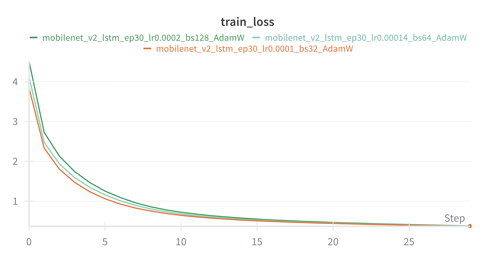
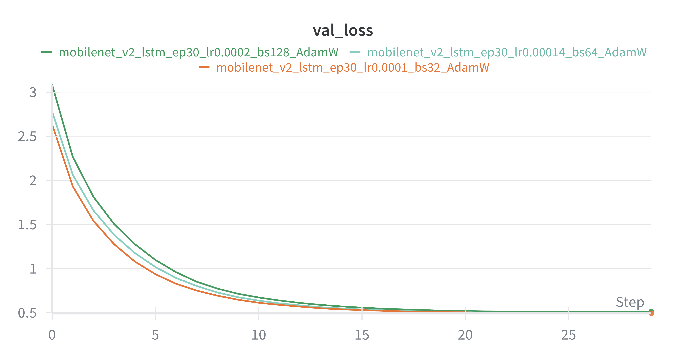
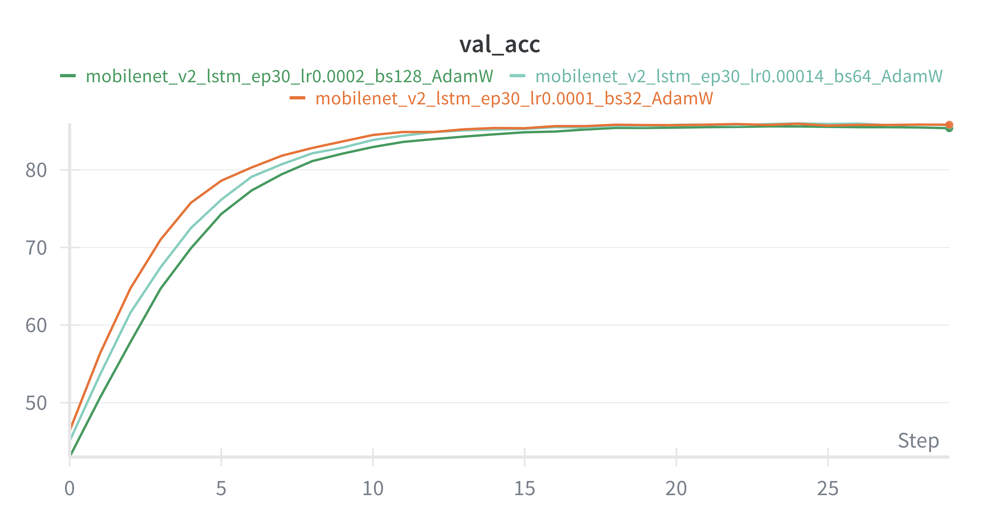

# 📸 Mini-ImageNet+ (MobileNet V2 & LSTM)

## Project Overview **

이 프로젝트는 MobileNet V2와 LSTM을 결합하여 이미지의 내용을 설명하는 문장을 생성하는 인공지능 모델입니다. 데이터 전처리부터 모델 학습, 그리고 BLEU 점수 및 Confusion Matrix를 통한 상세 성능 분석까지의 파이프라인을 포함합니다.

+blip에 대한 설명이 추가되면 좋을것 같습니다. gradio기준
-가벼운 MobileNet이 핵심 객체를 빠르게 파악하여'가이드라인'을 제시하면, 대형 생성 모델(BLIP)가 이를 정제하는 구조를 취함으로써 정확도와 속도의 균형을 달성.
Mobilenet의 역할은 이미지에서 가장 지배적인 특징ㅇ을 추출하여 전문 용어(vocab)기반의 객체명을 확정. BLIP의 역할은 추출된 키워드를 바탕으로 문법적 유창성을 더하여 풍부한 묘사생성
이로 인해 상호 검증 및 텍스트 정제를함. 모델 리드가 추출한 키워드와 BLIP의 생성 문장을 대조하여MobileNet이 제공하는 높은 분류 정확도(Acc 88.11%)를 기준점으로 삼아, 객체 정보가 불일치할 경우 모델 리드의 데이터를 우선순위로 하여 환각(Hallucination) 현상을 필터링함.

---

## 📊 Dataset Information
모델 학습 및 평가에 사용된 데이터셋의 상세 정보입니다.

* **클래스 구성**: 총 60종
* **데이터 분할**: 클래스당 240장/30장/30장 (Train/Val/Test) 구성 (8:1:1 비율)
* **해상도**: 256x256 pixels
* **데이터셋**: Classified images dataset (ImageNet 256×256) 일부

---
## 🏗 Model Architecture
효율적인 리소스 사용과 정확한 문장 생성을 위한 구조입니다.

1.  **Encoder (CNN)**
    * **MobileNet V2**: 이미지의 고차원 특징 벡터를 추출합니다.
    * **Linear Layer**: 추출된 벡터를 Decoder의 입력 차원(`embed_size: 300`)으로 변환합니다.
    * **Batch Normalization**: 학습의 안정성을 높입니다.
2.  **Decoder (RNN)**
    * **LSTM**: 이전 단어 정보와 이미지 특징을 결합하여 적절한 단어를 순차적으로 생성합니다.

---

## 📈 Performance Summary
학습 모델로 **MobileNet V2**를 선정한 이유와 분석 결과입니다.

### 📊 Model Complexity & Efficiency Comparison

| Model Name | Params (M) | FLOPs (G) | Latency (ms) |
| :--- | :---: | :---: | :---: |
| **ResNet-18** | 11.44 | 1.824 | 2.06 |
| **MobileNet V2** | **2.61** | **0.327** | 5.03 |
| **ViT+GPT2** | 86.83 | 16.980 | 12.64 |

### 💡 모델 선정 근거 및 분석
* **MobileNet V2의 경량성**: MobileNet V2는 ResNet-18 대비 약 4.4배 적은 파라미터와 **5.5배 낮은 연산량(FLOPs)**을 기록했습니다. 이는 리소스가 제한된 배포 환경(HuggingFace Spaces 등)에서 모델을 구동할 때 메모리 효율성과 비용 측면에서 압도적인 이점을 제공합니다.

* **ViT+GPT2 모델의 한계**: 실험 결과, ViT+GPT2 조합은 문장 생성 성능 면에서는 우수한 결과를 보였으나, MobileNet V2와 비교했을 때 연산량은 약 52배, 지연 시간(Latency)은 약 2.5배 더 높게 측정되었습니다.

* **사용자 고려**: 웹 환경에서 실시간으로 서비스를 이용하는 사용자에게 12.64ms의 지연 시간은 시스템 부하가 커질 경우 성능 저하로 이어질 가능성이 높습니다. 따라서 높은 생성 품질보다 빠른 응답 속도와 서버 안정성을 확보할 수 있는 MobileNet V2가 실 서비스 환경에 더욱 적합하다고 판단하였습니다.

---

## Training Logs
### 🖼 WandB Visualization

#### Loss Curves

  
  

#### Accuracy Trends

  

* **Loss Curve**: 학습이 진행됨에 따라 Train/Val Loss가 안정적으로 수렴하는 것을 확인할 수 있습니다. Train Loss는 초반에 급격히 하락하다가 후반부로 갈수록 완만하게 수렴하여 모델이 데이터의 패턴을 안정적으로 학습하고 있음을 보여줍니다. Val Loss는 Train Loss와 유사한 궤적을 그리며 하락하여 과적합(Overfitting)이 발생하지 않고 안정적으로 수렴했습니다. 이로 인해 전반적인 성능이 양호함을 확인할 수 있습니다.
* **Accuracy Curve**: 에폭(Epoch)이 진행됨에 따라 모델이 이미지의 클래스 키워드를 얼마나 잘 맞추는지 보여줍니다. 초반에 급격히 상승한 뒤, 완만한 경사를 그리며 약 85%에 안착하는 모습을 보입니다.

---

성능 분석 스크립트(`analysis_report.py`)를 통해 추출된 클래스별 세부 지표입니다. 캡션 생성 능력(BLEU-4)과 분류 정확도(Accuracy)의 상관관계를 확인할 수 있습니다.

### 1. 주요 성능 지표 (전체 평균)

* 평균 정확도 (Accuracy): 약 88.11%
* 평균 BLEU-4 Score: 약 0.2731
* 평균 F1-Score: 약 0.8683
* 평균 정밀도 (Precision): 약 0.8661

### 2. BLEU-4 Score 기준 상위 10개 및 하위 10개 클래스 분석 (BLEU-4, Accuracy)

#### 🏆 Top 10 Classes (Highest BLEU-4 Score)
모델이 정답 문장과 가장 유사한 설명을 생성한 클래스들입니다.

| 순위 | 클래스명 (Class) | BLEU-4 Mean | 정확도 (Accuracy) |
| :--: | :--- | :---: | :---: |
| 1 | **beaker** | **0.5266** | 0.9000 |
| 2 | spider | 0.4408 | 0.8667 |
| 3 | cannon | 0.4330 | 0.0000 |
| 4 | bullfrog | 0.4292 | 1.0000 |
| 5 | balloon | 0.4104 | 0.9667 |
| 6 | bald_eagle | 0.4011 | 0.9667 |
| 7 | black_and_gold_garden_spider | 0.3846 | 0.8667 |
| 8 | carpenter_s_kit | 0.3807 | 0.9000 |
| 9 | car_wheel | 0.3786 | 1.0000 |
| 10 | barracouta | 0.3777 | 0.9667 |
| - | **TOP 10 AVERAGE** | **0.4163** | **0.8433** |

#### 📉 Bottom 10 Classes (Lowest BLEU-4 Score)
객체 인식은 잘 되나, 문장 서술 난이도가 높았던 클래스들입니다.

| 순위 | 클래스명 (Class) | BLEU-4 Mean | 정확도 (Accuracy) |
| :--: | :--- | :---: | :---: |
| 1 | **backpack** | **0.0741** | 0.9000 |
| 2 | binoculars | 0.0932 | 0.8333 |
| 3 | airedale | 0.1260 | 1.0000 |
| 4 | barrel | 0.1335 | 0.8000 |
| 5 | agama | 0.1336 | 0.9667 |
| 6 | african_chameleon | 0.1494 | 0.9000 |
| 7 | african_crocodile | 0.1628 | 0.9333 |
| 8 | american_staffordshire_terrier | 0.1652 | 0.9333 |
| 9 | admiral | 0.1716 | 1.0000 |
| 10 | african_elephant | 0.1762 | 1.0000 |
| - | **BOTTOM 10 AVERAGE** | **0.1386** | **0.9267** |

---

### 📝 데이터 정밀 분석 결과 및 시사점

1. **지표 간의 역설적 관계**
   * 분석 결과, **BLEU-4 상위 10개 클래스의 평균 정확도(84.33%)**보다 **하위 10개 클래스의 평균 정확도(92.67%)**가 더 높게 나타났습니다.
   * 이는 모델이 객체를 정확히 분류(Classification)하더라도, 해당 객체를 묘사하는 문장(Captioning)을 생성하는 난이도는 별개의 영역임을 시사합니다.

2. **문장 생성 메커니즘의 특이점**
   * **`cannon`** 클래스의 경우 정확도가 **0.0**임에도 BLEU-4 점수는 **0.4330**으로 매우 높습니다.
   * 모델이 핵심 단어인 'cannon'을 직접적으로 언급하지는 못했으나, 주변 환경이나 상황을 설명하는 문장 구조가 실제 정답과 매우 유사하게 생성되었음을 보여주는 지표입니다.

+bleu 전체평균이 낮은 이유에 대해서 설명 추가하면 좋을 것 같습니다.
-BLUE 점수가 상대적으로 낮게 측정되는 것은 모델의 성능결함이 아닌, MobileNet 기반 디코더는 특정 이미지에 대해 가장 높은 확률을 가진 정형화된 전문 문장을 출력하는 경향이 강해 문구의 다양성은 부족할 수 있으나, 의미적 정확도와 분류의 일관성은 매우높아 사용자에게 신뢰도 높은 정보를 제공.
---

** Installation **

pip3 install -r requirements.txt
상세 내용은 "requirements.txt" 참고

** Project Structure **

* vocab.py: 학습 데이터셋을 기반으로 단어 사전("vocab.pkl")을 구축합니다.
* data_loader.py: 이미지 변형(Augmentation) 및 가변 길이 캡션을 위한 패딩 처리를 담당합니다.
* model.py: Encoder, Decoder 및 통합 모델(CNNtoRNN)이 정의되어 있습니다.
* train.py: 모델 학습을 진행하며, WandB를 통해 손실률과 정확도를 모니터링합니다.
* analysis_report.py: 학습된 모델을 평가하여 BLEU4 점수, F1-Score, Confusion Matrix 등을 생성합니다.

** Execution Steps **

* For User

1) 미리 학습된 모델을 아래 링크를 통해 다운 받으세요.
https://drive.google.com/drive/folders/1GOOzF9J4YITn1SimxxeiJzHmtDYS8J6H?usp=sharing
2) 모델을 로드하여 검증 데이터셋(val)에 대한 상세 보고서를 생성합니다.
3) "test_inference.py"를 실행하여 테스트 데이터셋(test)에서 서로 다른 20개의 클래스를 임의로 선정하고 각 클래스별 이미지 1장을 추론하여 결과물을 보여주고 이미지 파일로 저장합니다. 

* For Developer

1) 먼저 필요한 라이브러리(requirements.txt)를 설치한 후, 아래 순서대로 스크립트를 실행하면 됩니다.
2) 학습 데이터에서 빈도수가 높은 단어를 추출하여 사전을 만듭니다. -> "vocab_#.pkl" 생성
3) 생성된 .pkl 파일의 이름을 "data_loader.py" 의 전역변수(CONFIG) 중 'vocab_path'에 붙여 넣습니다.
4) "model.py"를 실행한 후, "train.py" 내의 'CONFIG' 에서 최적의 학습에 적합한 변수를 설정한 후 학습을 시작합니다.
5) 학습이 완료되면 './checkpoints' 경로에 있는 학습된 최적의 모델의 이름을 "analysis_report.py"의 'MODEL_PATH'에 붙여 넣습니다.
6) 최적의 모델을 로드하여 검증 데이터셋(val)에 대한 상세 보고서를 생성합니다.
7) "test_inference.py"를 실행하여 테스트 데이터셋(test)에서 서로 다른 20개의 클래스를 임의로 선정하고 각 클래스별 이미지 1장을 추론하여 결과물을 보여주고 이미지 파일로 저장합니다.
