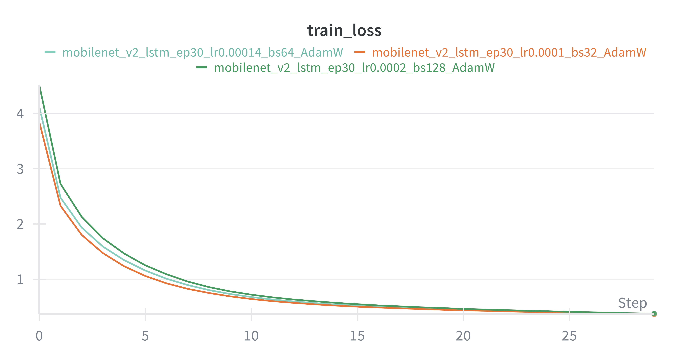
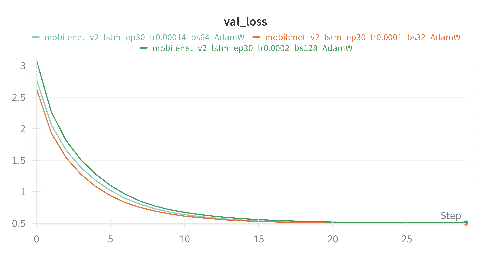
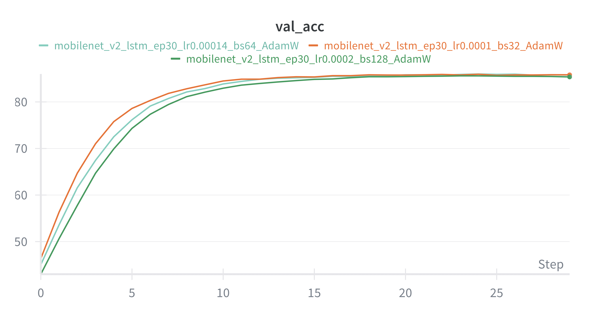

# 📸 Image Captioning Project: MobileNet V2 & LSTM

MobileNet V2와 LSTM을 결합하여 이미지의 내용을 설명하는 문장을 생성하는 인공지능 모델입니다. 데이터 전처리부터 모델 학습, 그리고 성능 분석까지의 전체 파이프라인을 포함합니다.

---

## Project Overview **

이 프로젝트는 MobileNet V2와 LSTM을 결합하여 이미지의 내용을 설명하는 문장을 생성하는 인공지능 모델입니다. 데이터 전처리부터 모델 학습, 그리고 BLEU 점수 및 Confusion Matrix를 통한 상세 성능 분석까지의 파이프라인을 포함합니다.

---

## 📊 Dataset Information
모델 학습 및 평가에 사용된 데이터셋의 상세 정보입니다.

* **클래스 구성**: 총 60종
* **데이터 분할**: 클래스당 240/30/30 (Train/Val/Test) 구성 (8:1:1 비율)
* **해상도**: 256x256
* **데이터셋**: Classified images dataset (ImageNet 256×256) 일부

---
## 🏗 Model Architecture
효율적인 리소스 사용과 정확한 문장 생성을 위한 구조입니다.

1.  **Encoder (CNN)**
    * **MobileNet V2**: 이미지의 고차원 특징 벡터를 추출합니다.
    * **Linear Layer**: 추출된 벡터를 Decoder의 입력 차원(`embed_size: 300`)으로 변환합니다.
    * **Batch Normalization**: 학습의 안정성을 높입니다.
2.  **Decoder (RNN)**
    * **LSTM**: 이전 단어 정보와 이미지 특징을 결합하여 적절한 단어를 순차적으로 생성합니다.

---

## 📈 Performance Summary
학습 모델로 **MobileNet V2**를 선정한 이유와 분석 결과입니다.

### 📊 Model Complexity & Efficiency Comparison

| Model Name | Params (M) | FLOPs (G) | Latency (ms) |
| :--- | :---: | :---: | :---: |
| **ResNet-18** | 11.44 | 1.824 | 2.06 |
| **MobileNet V2** | **2.61** | **0.327** | 5.03 |

> **Note:** MobileNet V2는 ResNet-18 대비 약 4.4배 적은 파라미터와 5.5배 낮은 연산량을 가집니다. 이는 모델 경량화를 통해 배포 환경(HuggingFace Spaces 등)에서의 리소스 효율성을 높이기 위한 선택입니다.

### 1. Training Logs (WandB)
## 🖼 WandB Visualization

### 📊 Loss Curves

  
  

### 📈 Accuracy Trends

  

* **Loss Curve**: 학습이 진행됨에 따라 Train/Val Loss가 안정적으로 수렴하는 것을 확인할 수 있습니다.
* **Accuracy Curve**: 에폭(Epoch)이 반복될수록 캡션 생성의 정확도가 향상되는 추세를 보입니다.

"analysis_report.py" 실행하여 생성된 파일들을 바탕으로 분석한 결과입니다.

1. 주요 성능 지표 (전체 평균)

평균 정확도 (Accuracy): 약 88.11%
평균 BLEU-4 Score: 약 0.2731
평균 F1-Score: 약 0.8683
평균 정밀도 (Precision): 약 0.8661

2. BLEU-4 Score 기준 상위 10개 및 하위 10개 클래스 분석(BLEU-4, Accuracy)

### [Top 10 Classes by BLEU-4 Mean]

| Class | BLEU-4 Mean | Accuracy |
| :--- | :---: | :---: |
| beaker | 0.5266 | 0.9000 |
| spider | 0.4408 | 0.8667 |
| cannon | 0.4330 | 0.0000 |
| bullfrog | 0.4292 | 1.0000 |
| balloon | 0.4104 | 0.9667 |
| bald_eagle | 0.4011 | 0.9667 |
| black_and_gold_garden_spider | 0.3846 | 0.8667 |
| carpenter_s_kit | 0.3807 | 0.9000 |
| car_wheel | 0.3786 | 1.0000 |
| barracouta | 0.3777 | 0.9667 |
| **TOP 10 AVERAGE** | **0.4163** | **0.8433** |

### [Bottom 10 Classes by BLEU-4 Mean]

| Class | BLEU-4 Mean | Accuracy |
| :--- | :---: | :---: |
| backpack | 0.0741 | 0.9000 |
| binoculars | 0.0932 | 0.8333 |
| airedale | 0.1260 | 1.0000 |
| barrel | 0.1335 | 0.8000 |
| agama | 0.1336 | 0.9667 |
| african_chameleon | 0.1494 | 0.9000 |
| african_crocodile | 0.1628 | 0.9333 |
| american_staffordshire_terrier | 0.1652 | 0.9333 |
| admiral | 0.1716 | 1.0000 |
| african_elephant | 0.1762 | 1.0000 |
| **BOTTOM 10 AVERAGE** | **0.1386** | **0.9267** |

3. 결과 요약
BLEU-4 점수가 높은 상위 10개 클래스의 평균 정확도(84.33%)가 하위 10개 클래스의 평균 정확도(92.67%)보다 낮게 나타났습니다. 이는 모델이 이미지를 정확하게 분류하지 못하더라도, 해당 클래스의 특징적인 문장 구조를 생성하는 능력은 높을 수 있음을 시사합니다.

** Installation **

pip3 install -r requirements.txt
상세 내용은 "requirements.txt" 참고

** Project Structure **

* vocab.py: 학습 데이터셋을 기반으로 단어 사전("vocab.pkl")을 구축합니다.
* data_loader.py: 이미지 변형(Augmentation) 및 가변 길이 캡션을 위한 패딩 처리를 담당합니다.
* model.py: Encoder, Decoder 및 통합 모델(CNNtoRNN)이 정의되어 있습니다.
* train.py: 모델 학습을 진행하며, WandB를 통해 손실률과 정확도를 모니터링합니다.
* analysis_report.py: 학습된 모델을 평가하여 BLEU4 점수, F1-Score, Confusion Matrix 등을 생성합니다.

** Execution Steps **

* For User

1) 미리 학습된 모델을 아래 링크를 통해 다운 받으세요.
https://drive.google.com/drive/folders/1GOOzF9J4YITn1SimxxeiJzHmtDYS8J6H?usp=sharing
2) 모델을 로드하여 검증 데이터셋(val)에 대한 상세 보고서를 생성합니다.
3) "test_inference.py"를 실행하여 테스트 데이터셋(test)에서 서로 다른 20개의 클래스를 임의로 선정하고 각 클래스별 이미지 1장을 추론하여 결과물을 보여주고 이미지 파일로 저장합니다. 

* For Developer

1) 먼저 필요한 라이브러리(requirements.txt)를 설치한 후, 아래 순서대로 스크립트를 실행하면 됩니다.
2) 학습 데이터에서 빈도수가 높은 단어를 추출하여 사전을 만듭니다. -> "vocab_#.pkl" 생성
3) 생성된 .pkl 파일의 이름을 "data_loader.py" 의 전역변수(CONFIG) 중 'vocab_path'에 붙여 넣습니다.
4) "model.py"를 실행한 후, "train.py" 내의 'CONFIG' 에서 최적의 학습에 적합한 변수를 설정한 후 학습을 시작합니다.
5) 학습이 완료되면 './checkpoints' 경로에 있는 학습된 최적의 모델의 이름을 "analysis_report.py"의 'MODEL_PATH'에 붙여 넣습니다.
6) 최적의 모델을 로드하여 검증 데이터셋(val)에 대한 상세 보고서를 생성합니다.
7) "test_inference.py"를 실행하여 테스트 데이터셋(test)에서 서로 다른 20개의 클래스를 임의로 선정하고 각 클래스별 이미지 1장을 추론하여 결과물을 보여주고 이미지 파일로 저장합니다.